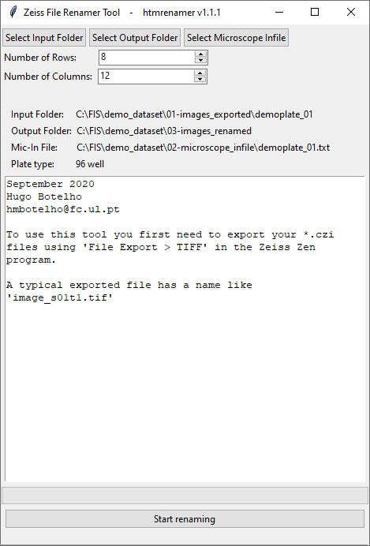
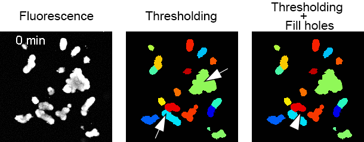
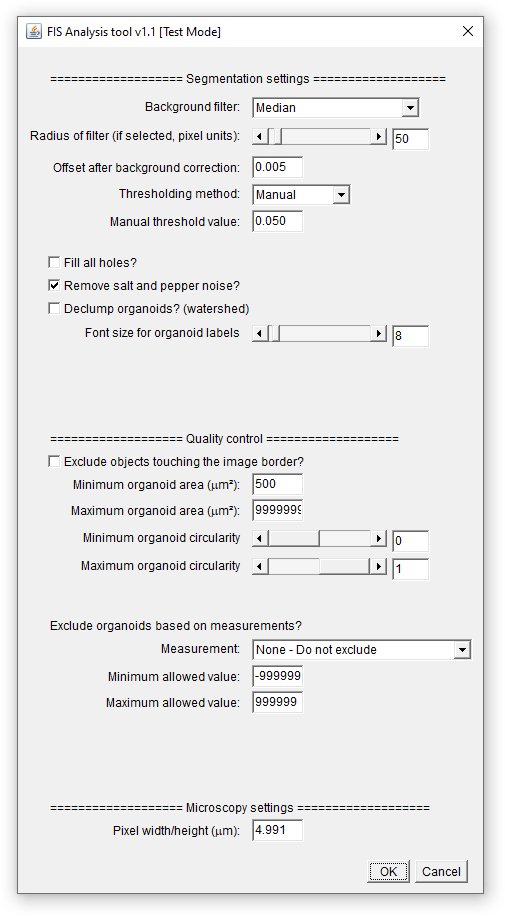

# Analysis of the Forskolin-induced swelling (FIS) assay
*Open source workflow: quick reference guide*


## Table of Contents
* [1. Overview](#overview)
* [2. Citation](#citation)
* [3. Setup](#setup)
  * [3.1. File renaming](#setup-renaming)
  * [3.2. Image analysis](#setup-imageanalysis)
  * [3.3. Data analysis](#setup-dataanalysis)
* [4. Demonstration datase](#dataset)
    * [4.1. Assay description](#dataset-description)
    * [4.2. File download](#dataset-files)
* [5. Analysis of the demonstration dataset](#analysis)
    * [5.1. Generate TIF files](#analysis-exporttif)
    * [5.2. Generate well descriptors (infile)](#analysis-infile)
    * [5.3. Rename raw files](#analysis-renaming)
    * [5.4. Image analysis](#analysis-imageanalysis)
        * [5.4.1. CellProfiler](#analysis-imageanalysis-CP)
        * [5.4.2. Fiji/ImageJ](#analysis-imageanalysis-IJ)
            * [5.4.2.1. Test mode](#analysis-imageanalysis-IJ-testmode)
            * [5.4.2.2. Batch Analysis mode](#analysis-imageanalysis-IJ-batchmode)
     * [5.5. Statistical data analysis](#analysis-statistics)
* [6. Interpretation of the results](#interpretation)
* [7. License](#license)
* [8. References](#references)


## <a name="overview">1. Overview</a>
The forskolin-induced swelling (FIS) assay has become the preferential assay of choice to assess the efficacy of established and investigational CFTR-modulating compounds for individuals that suffer from cystic fibrosis (CF) [[1](#ref01)]. In this step-by-step protocol, we describe a complete workflow using open-source software to perform standardized analysis of CFTR function measurements of intestinal (CF) organoids. The workflow comprises 3 steps:

1. **Renaming of raw microscopy images**  
    *Convert raw microscopy images to a common format, regardless of microscope brand or imaging modality.*  
    *Include experimental metadata in file names.*  
    *Implemented in **htmrenamer**. [More info](https://github.com/hmbotelho/htmrenamer).*


2. **Image analysis**  
    *Measurement of organoid area.*  
    *Implemented in **CellProfiler** or **Fiji/ImageJ**. [More info](https://github.com/hmbotelho/FIS_image_analysis).*  


3. **Data analysis**  
    *Including data visualization, exploratory data analysis, quality control and normalization.*
    *Implemented in **Organoid Analyst**. [More info](https://github.com/hmbotelho/organoid_analyst).*

<br/>


<br/>


    Organoid Analyst computes the following statistics on the dataset:  
    * **AUC (area under the curve):** calculated between the first and the last time points of the experiment (usually: 0 and 60 min).
    * **ISR (initial swelling rate):** the slope of a line fitted to the region of maximal linear swelling as measured in the normalized kinetic curves.
    * **Aₜ/A₀:** normalized area value at the final time point of the FIS assay (Aₜ), using normalization factor A₀ = 100%.


<br/>


Equivalent results can be obtained regardless of the microscope manufacturer (Zeiss and Leica are currently supported) or the image analysis tool (CellProfiler or Fiji) selected by the user, as shown below.

<br/>


<br/>

This document contains links to all software tools, together with a demonstration dataset and expected results.


## <a name="citation">2. Citation</a>
Hagemeijer *et al* (2020) **An open-source high-content analysis workflow for CFTR function measurements using the forskolin-induced swelling assay** *submitted*


## <a name="setup">3. Setup</a>
This section describes how to install the software required for the FIS analysis workflow.  


### <a name="setup-renaming">3.1. File renaming</a>

* **For handling Zeiss files**  
    
    1. **Install ZEN (blue edition):** The LITE version can be downloaded [here](https://www.zeiss.com/microscopy/int/products/microscope-software/zen-lite.html).  
    
    2. **Acquire a FIS time lapse and export as TIF:** (`File > Export/Import > Export > TIFF`).  


* **For handling Leica files**  
    
    1. Images must be acquired with the MatrixScreener module of the [Leica LAS X](https://www.leica-microsystems.com/products/microscope-software/p/leica-las-x-ls/) software and exported as OME-TIFF.  


* **Install the htmrenamer R package**  

    1. **Install Java:** get the Oracle JDK from [here](https://www.oracle.com/technetwork/java/javase/downloads/).  


    2. **Install XQuartz (macOS only):** Download [here](https://www.xquartz.org/).  


    3. **Install R:** Download [here](https://cran.r-project.org/).  


    4. **Install the htmrenamer package:** in the R command line type

    ```
    install.packages("devtools")
    library(devtools)
    install_github("hmbotelho/htmrenamer")
    ```


* **Describe the contents of the assay plate (infile)**

    1. Blank infile templates can be obtained [here](https://github.com/hmbotelho/htmrenamer/blob/master/extras/InFile_template.xlsx) or through the following R commands:
    
    ```
    library("htmrenamer")
    newinfile.char(8, 12, show = TRUE, saveto = "myinfile.txt")
    ```


Detailed information available [here](https://github.com/hmbotelho/htmrenamer).


### <a name="setup-imageanalysis">3.2. Image analysis</a>

* **Image analysis with CellProfiler**  

    1. **Install CellProfiler:** download [here](https://cellprofiler.org/releases/)
    
    
    2. **Download image analysis pipelines:** download [here](https://github.com/hmbotelho/FIS_image_analysis/tree/master/CellProfiler)
    

* **Image Analysis with Fiji/ImageJ**  
    1. **Install Fiji:** download from [here](http://fiji.sc/).
    
    
    2. **Download image analysis scripts:** download [here](https://github.com/hmbotelho/FIS_image_analysis/tree/master/Fiji_ImageJ).
    
    
    3. **Install scripts: (Windows):** in the folder `\Fiji.app\scripts` create a subfolder named `FIS` and copy the `FIS_test....ijm` and `FIS_analysis....ijm` files there.
    
    
    4. **Install scripts: (macOS):** in Finder, go to Applications, locate Fiji, right click and select `Show Package Contents`. In the `Scripts` folder create a subfolder named `FIS` and copy the `FIS_test....ijm` and `FIS_analysis....ijm` files there.


Detailed information available [here](https://github.com/hmbotelho/FIS_image_analysis).


### <a name="setup-dataanalysis">3.3. Data analysis</a>

    1. **Install R:** as shown above.


    2. **Install Fiji:** as shown above.


    3. **Install Organoid Analyst:** in the R console type
    
    ```
    library(shiny)
    runGitHub("organoid_analyst", "hmbotelho", launch.browser = T)
    ```


Detailed information available [here](https://github.com/hmbotelho/organoid_analyst).


## <a name="dataset">4. Demonstration dataset</a>


### <a name="dataset-description">4.1. Assay description</a>
The FIS assay was performed with intestinal organoids homozygous for a class II CFTR mutation in the absence (DMSO) or presence of VX-809 and/or VX-770 (3.2 μM), as previously described [[2](#ref02)]. CFTR was activated by addition of forskolin (Fsk) in a concentration range from 0.008 μM – 5 μM. Specimens were laid out in a 96 well plate, as depicted below.


These are the main characteristics of the microscopy images in the demonstration dataset:

- __Imaging system:__ Zeiss confocal microscope
- __Number of plates:__ 1
- __Number of imaged wells:__ 64
- __Number of imaging fields per well:__ 1
- __Number of raw images (TIF):__ 448
- __Number of timepoints:__ 7
- __Time interval between frames:__ 10 min
- __Total experiment time:__ 60 min
- __Image resolution:__ 512 x 512 pixels  
- __Pixel dimensions:__ 4.991 x 4.991 μm
- __Image bit depth:__ 8 bit
- __Number of fluorescence channels:__ 1 (calcein green)


### <a name="dataset-files">4.2. File download</a>

The demonstration dataset is comprised of:
1. [**Raw microscopy images (native CZI format)**](./demo_dataset/00-images_raw) (`00-images_raw/demoplate_01.czi`, 169 MB)
2. [**Raw microscopy images (TIF export)**](./demo_dataset/01-images_exported/demoplate_01) (`01-images_exported/demoplate_01`, 91.8 MB)
3. [**Well contents description**](./demo_dataset/02-microscope_infile/demoplate_01.txt) (`02-microscope_infile/demoplate_01.txt`, 3 KB)
4. [**Raw microscopy images (renamed)**](./demo_dataset/03-images_renamed/demoplate_01) (`03-images_renamed/demoplate_01`, 91.9 MB)
5. [**Pre-configured CellProfiler and Fiji image analysis pipelines**](./demo_dataset/04-analysis_pipelines) (`04-analysis_pipelines`, 1.2 MB)
6. [**Image quantification outputs (CellProfiler)**](./demo_dataset/05-images_analysis/demoplate_01--cellprofiler) (`05-images_analysis/demoplate_01--cellprofiler`, 14.8 MB)
7. [**Image quantification outputs (Fiji)**](./demo_dataset/05-images_analysis/demoplate_01--ij) (`05-images_analysis/demoplate_01--ij`, 16.0 MB)
8. [**Quantification summary (from CellProfiler data)**](./demo_dataset/05-images_analysis/demoplate_01--cellprofiler--analysis) (`05-images_analysis/demoplate_01--cellprofiler--analysis`, 37.0 MB)
9. [**Quantification summary (from Fiji data)**](./demo_dataset/05-images_analysis/demoplate_01--ij--analysis) (`05-images_analysis/demoplate_01--ij--analysis`, 36.1 MB)

[Download the entire demonstration dataset](./demo_dataset) (458 MB).


## <a name="analysis">5. Analysis of the demonstration dataset</a>


### <a name="analysis-exporttif">5.1. Generate TIF files</a>

This section generates TIF files which are the required input for the workflow.


1. Open the native [CZI file](./demo_dataset/00-images_raw/demoplate_01.czi) in ZEN Blue.


2. Export as TIF (`File > Export/Import > Export > TIFF`).

**Expected result:** [`01-images_exported`](./demo_dataset/01-images_exported/demoplate_01)


### <a name="analysis-infile">5.2. Generate well descriptors (infile)</a>

This section generates a microscope infile, which is a description of the contents of each well of the FIS assay plate.


1. A customized infile for each assay plate can be created by using [this template](https://github.com/hmbotelho/htmrenamer/blob/master/extras/InFile_template.xlsx) or with the following R commands:
    
    ```
    library("htmrenamer")
    newinfile.char(8, 12, show = TRUE, saveto = "myinfile.txt")
    ```


**Infile for the demonstration dataset:** [`demoplate_01.txt`](./demo_dataset/02-microscope_infile)


### <a name="analysis-renaming">5.3. Rename raw files</a>

This section renames the TIF files, to include relevant metadata in their file names.

1. Open R and type
```
library(htmrenamer)
rename_zeiss_gui()
```


2. Enter the following information:

    * Location of the raw TIF files (`01-images_exported/demoplate_01`)  
    * Location for renamed files (any folder)
    * Location of the infile (`demoplate_01.txt`)
    * Number of rows and columns in the assay plate (8 & 12)


3. Click `Start renaming` and wait for the renaming process.




<br/>

**Expected result:** [`03-images_renamed`](./demo_dataset/03-images_renamed/demoplate_01)


### <a name="analysis-imageanalysis">5.4. Image analysis</a>

This section describes how to measure organoid areas in the demonstration dataset, using CellProfiler or Fiji. CellProfiler is recommended for most situations, as described [here](https://github.com/hmbotelho/FIS_image_analysis#background).


### <a name="analysis-imageanalysis-CP">5.4.1. CellProfiler</a>


1. Open CellProfiler.


<br/>


2. Click `File > Open Project...` and load the [`cp_pipeline_demo.cpproj`](./demo_dataset/04-analysis_pipelines/cp_pipeline_demo.cpproj) file. This project file has been pre-configured with optimal settings for analyzing the demonstration dataset.


3. Click `Window > Show All Windows On Run` to make CellProfiler display all image processing steps as they occur.


4. In the **Images** module, remove all previously listed files (drag mouse and press `delete`) and drag [raw microscopy images](./demo_dataset/03-images_renamed/demoplate_01) to the white box named `Drop files and folders here`.


Let us now define image analysis parameters interactively.


5. Enter into **Test Mode** by clicking `Test > Start Test Mode`. The active module will now appear underlined (*e.g.* ). Click on  after each step to examine the output of the active module.


6. Go to  `Test > Choose Image Group` to select a well to test the image analysis settings on. We will use [well B8 (well #20) from the demonstration dataset](./demo_dataset/03-images_renamed/demoplate_01/W0020--fsk_770_809--5/P001--fsk_770_809--5) as an example.


7. Click  until reaching the IdentifyPrimaryObjects module.


8. The **IdentifyPrimaryObjects** module performs organoid segmentation and is the most critical step in the analysis. With the exception of `Name the primary objects to be identified` all settings may need to be adjusted for each experiment. The following settings need adjustment most often:  
    - **Typical diameter of objects:** In pixel units. The minimum and maximum size of a circle with the same area as the organoids. Organoids outside this range will be discarded.
    - **Threshold correction factor:** Controls threshold stringency. A factor of 1 means no adjustment, 0 to 1 lowers the threshold value and > 1 increases the threshold value. 
    
    The following may also need occasional adjustment:  
    - **Threshold smoothing scale:** Controls image smoothing before the thresholding step. Images with noise usually require more smoothing.
    - **Suppress local maxima that are closer than...:** In pixel units. Defines the maximum radius in which only 1 organoid should be present (the approximate radius of the smallest expected organoid).
    - **Fill holes in identified objects:** Allows for filling holes of the identified objects after thresholding of the image. When calcein labelling is intense across all wells and time points, `Never` should be selected, as this typically results in less artefacts. However, when there is significant organoid swelling calcein fluorescence is frequently low in the lumen producing objects with holes. We recommend selecting `After both thresholding and declumping` when this occurs. Filling holes may produce an overestimation of organoid size if densely packed organoids touch each other and produce voids (see below).
    
    
    
    *Fluorescence image before and after thresholding with and without `Fill holes after both thresholding and declumping`. Note that not filling holes produces an unsatisfactory segmentation with ring-shaped organoids (arrows). When Fill Holes is enabled, most organoids are correctly segmented but a background region is wrongly classified as object at the 40 min frame (arrowhead).*
    *To test this time lapse experiment in CellProfiler select `Test > Choose Image Group > Metadata_wellNum=0020` and `Test > Choose Image Set` to select each time point. Segmentation masks have been re-coloured to accurately track objects. Panels show a portion of the entire image.*


7. Adjust parameters until satisfactory segmentation is achieved.


8. Click  until reaching the DisplayDataOnImage module.


9. The **DisplayDataOnImage** module is involved in object-level quality control. The user may select any object feature to overlay it on top of each organoid. This assists the user's decision on selecting thresholds to exclude undesired objects.


10. The **FilterObjects** module allows excluding individual organoids based on fluorescence intensity of morphological features. In the `Category` and `Measurement` boxes select the feature chosen in step 9. In `Minimum value` and `Maximum value` insert the range of allowed values. Organoids with values outside this range will be discarded. Below is an example where  [FormFactor](http://cellprofiler-manual.s3.amazonaws.com/CellProfiler-3.0.0/modules/measurement.html) allows for a perfect discrimination of live (FormFactor ≥ 0.5) and dead (FormFactor = 0.22) organoids.

    
    *An example where objects with FormFactor > 0.3 were approved thereby excluding irregular structures surrounded by cell clumps from the analysis (arrowhead). Segmentation masks show the identified objects from the segmentation step (`organoids_prelim`) and identified objects by applying the quality control criteria (`organoids`). Panels show a portion of the images from [well H4, #88](./demo_dataset/03-images_renamed/demoplate_01/W0088--fsk_809--0.32/P001--fsk_809--0.32) from the demonstration dataset.*
 
    **Disable the filtering by entering excessively low or high values.**  


11. Click  until reaching the TrackObjects module.


12. The **TrackObjects** module assigns a unique numeric label to the same organoid across all time lapse frames. `Maximum pixel distance to consider matches` should be adjusted to the maximum number of pixels an organoid is expected to drift along two consecutive  frames. If `Minimum lifetime` is adjusted to be *n* - 1, where *n* is the number of time points in the time lapse, organoids which are not tracked throughout the entire time lapse (*e.g.* organoids that touch one another and are not declumped) will be assigned the reference *NaN*. This can optionally be used to exclude those organoids from data analysis.  


13. The **CalculateMath** module converts the pixel size to micron units. Fill the `Multiply the above operand by` field with the square of the pixel width/height (_e.g._ if the pixel dimensions are 4.991 × 4.991 μm, the conversion factor is 24.910081).


14. Use `Test > Choose Image Group` and `Test > Choose Image Set` to examine additional images in the dataset, until determining image analysis parameters adequate for all images in the dataset.


14. In **View output settings**, under **Default Output Folder** specify where to store the analyzed data.


15. Save a copy of the CellProfiler project by clicking `File > Save Project As...`.


16. Activate `Window > Hide All Windows On Run`.


17. Start the analysis of the whole dataset by clicking on the  button.


18. CellProfiler will produce an output folder identified by the `--cellprofiler` suffix. One `objects.csv` file is generated for each well in the assay plate. Each line in this file refers to one object (*i.e.* organoid) on an image, and each column is one feature for that object.


**Expected result:** [`05-images_analysis/demoplate_01--cellprofiler`](./demo_dataset/05-images_analysis/demoplate_01--cellprofiler)


### <a name="analysis-imageanalysis-IJ">5.4.2. Fiji/ImageJ</a>


The Fiji workflow comprises two scripts:
* The **test** script is used to test single images and determine the analysis parameters for optimal segmentation.
* The **analysis** script processes a complete dataset using the parameters determined above.


#### <a name="analysis-imageanalysis-IJ-testmode">5.4.2.1. Test mode</a>

1. Open Fiji.


2. Open an image (`File > Open...`) to optimize the analysis settings. For this example use the [first time point from well B8 (#20) from the demonstration dataset](./demo_dataset/03-images_renamed/demoplate_01/W0020--fsk_770_809--5/P001--fsk_770_809--5/demoplate_01--fsk_770_809--5--W0020--P001--T0000--C00.tif) as an example.


3. Start the test mode by selecting `FIS > FIS test...`.

    

<br/>


4. The test mode window will open.

    


5. Define analysis parameters for the selected image:  

    **Background filter:** The filter which generates a pseudo-flat field from the fluorescence image. The pseudo-flat field will be subtracted to the raw fluorescence image to generate a background corrected image. Selecting `No filter (flat background)` disables this correction.  
    **Radius of filter:** The radius of the background filter, in pixel units. 
    **Offset after background correction:** This value will be subtracted from all pixels after background correction, regardless of the background filter option. Offsetting may be necessary when the fluorescence baseline is not zero after the pseudo-flat field correction.  
    **Manual threshold value:** This will be applied after pseudo-flat field subtraction, offset correction and grey value rescaling to [0 ~ 1]. All pixels above this grey value will be assigned to objects (organoids).  
    **Fill all holes:**. When unchecked, an [optimized hole filling algorithm](https://github.com/hmbotelho/FIS_image_analysis#background) is applied. When checked, all holes are filled after the thresholding step.  
    **Remove salt and pepper noise:** When checked, isolated pixels in the thresholded image will be removed.  
    **Font size for organoid labels:** Each segmented organoid will be overlaid with a unique label having this font size.  
    **Exclude objects touching the image border:** When checked, all objects which touch the image border on each image will be discarded from the analysis.  
    **Minimum organoid area:** Minimum allowed size of organoids (in μm² units). Smaller objects (*e.g.* debris) will be discarded from the analysis.  
    **Maximum organoid area:** Maximum allowed size of organoids (in μm² units). Larger objects will be discarded from the analysis.  
    **Minimum organoid circularity:** Minimum allowed circularity of organoids. Organoids with lower circularity will be discarded from the analysis. **Note:** 0 ≤ circularity ≤ 1  
    **Maximum organoid circularity:** Maximum allowed circularity of organoids. Organoids with higher circularity will be discarded from the analysis. **Note:** 0 ≤ circularity ≤ 1  
    **Exclude organoids based on measurement:** Besides area and circularity, an additional feature can be selected here for additional object-level quality control purposes. A common use case is to use this option to discard dead organoids.  
    **Minimum allowed value:**  Minimum allowed value for the additional quality control measurement. Organoids with smaller values will be discarded from the analysis.  
    **Maximum allowed value:** Maximum allowed value for the additional quality control measurement. Organoids with larger values will be discarded from the analysis.  
    **Pixel width/height:** Pixel size in the raw microscopy image. This is used to set the image scale throughout the test and analysis processes.  


6. Click the `OK` button to test the analysis settings in the open image.  


7. Fiji will apply the test settings display the results of each analysis step. Images are numbered according to the sequence of operations. More details are available [here](https://github.com/hmbotelho/FIS_image_analysis#421-test-mode).  

    

    <br/>


8.	The `Results` will display the features of all objects, which may be used to determine object-level quality control values. The log window will show currently applied settings.  

      
    
    <br/>
    

9. Inspect the `ORGANOIDS_FINAL` image to judge the quality of background subtraction, segmentation and object/level quality control.  


10. Click the `OK` button in the box below to return to the test mode tool.


11. Adjustment the analysis settings as many times as required to obtain an adequate segmentation.


12. Click `Cancel` or `Close` to exit the test mode.


13. To ensure that the selected analysis settings are suitable for the entire dataset, several images should be tested.

    

#### <a name="analysis-imageanalysis-IJ-batchmode">5.4.2.2. Batch Analysis mode</a>

1. Open Fiji.


2. Start the batch analysis mode by selecting `FIS > FIS analysis...`.


3. The batch analysis window will open.
 
    

    <br/>


4. Enter the parameters selected in the test mode. For batch analysis, 3 additional parameters are required:

    * **Regular expression matching all files being analyzed**: the default expression `.*--C00(?:.ome)??.tif$` will match the images generated by the `htmrenamer` tool. If needed, replace `C00` with the channel name for the fluorescence image.  
    
    * **Folder location > Raw FIS images**:  The folder containing renamed fluorescence images. [See example here](./demo_dataset/03-images_renamed/demoplate_01).  
    
    * **Folder location > Results**: The folder where analysis results will be saved.   
    
    The demo dataset was analyzed using the following settings:


    <a name="parameters-ij"></a>

    | **Parameter**                                | **Value**              |
    |----------------------------------------------|------------------------|
    | _Background filter_                          | Median                 |
    | _Radius of filter_                           | 50                     |
    | _Offset after background correction_         | 0.005                  |
    | _Manual threshold value_                     | 0.05                   |
    | _Fill all holes?_                            | No                     |
    | _Remove salt and pepper noise?_              | Yes                    |
    | _Exclude objects touching the image border?_ | No                     |
    | _Minimum organoid size_                      | 500 μm²                |
    | _Maximum organoid size_                      | 99999999 μm²           |
    | _Minimum organoid circularity_               | 0                      |
    | _Maximum organoid circularity_               | 1                      |
    | _Exclude organoids based on measurements?_   | None - Do not exclude  |
    | _Minimum allowed value_                      | _Irrelevant_           |
    | _Maximum allowed value_                      | _Irrelevant_           |
    | _Pixel width/height_                         | 4.991 μm               |
    | _Regular expression_                         | .*--C00(?:.ome)??.tif$ |


5. Click `OK` to start the analysis.


6.	The Fiji analysis will produce a results folder with a `--ij` suffix. Analysis settings will be stored in a file named `settings_YYYY-MM-DD_HH-MM.log`. The output files are segmentation masks (PNG, one per time frame) and CSV files (one per well) that contain quantitative features (_e.g._ organoid area) and metadata. Each line of the CSV file represents one object in one image.


**Expected result:** [`05-images_analysis/demoplate_01--ij`](./demo_dataset/05-images_analysis/demoplate_01--ij)


### <a name="analysis-statistics">5.5. Statistical data analysis</a>

This section describes how to use the [**Organoid Analyst**](https://github.com/hmbotelho/organoid_analyst/) application to visualize the image analysis measurements and compute summary statistics on the dataset. Organoid Analyst will analyze data from one plate at a time.


1. Open R and type the following commands:

```
library(shiny)
runGitHub("organoid_analyst", "hmbotelho", launch.browser = T)
```


2. Organoid Analyst will open in a new browser window
    
    

    <br/>


3. Under `1. Load data`, click on `Choose a '--cellprofiler' or '--ij' folder...` and select the [`demoplate_01--cellprofiler` folder](./demo_dataset/05-images_analysis/demoplate_01--cellprofiler) from the demonstration dataset.


4. Wait while Organoid Analyst concatenates the `objects.csv` files (one per well) generated during the image analysis process.


5. Under `2. Settings` inform Organoid Analyst on relevant information about the experiment:


    | **Parameter**                                  | **Value**                                                         |
    |------------------------------------------------|-------------------------------------------------------------------|
    | **Experiment Settings**                        |                                                                   |
    | _Time resolution (minutes per timepoint)_      | 10                                                                |
    | _Name of the column with AREA values_          | Math_area_micronsq                                                |
    | _Name of the column with TIME values_          | Metadata_timeNum                                                  |
    | _Name of the column with WELL values_          | Metadata_wellNum                                                  |
    | _Name of the column with COMPOUND names_       | Metadata_compound                                                 |
    | _Name of the column with CONCENTRATION values_ | Metadata_concentration                                            |
    | _Number of rows_                               | 8                                                                 |
    | _Number of columns_                            | 12                                                                |
    | **Quality Control Settings**                   |                                                                   |
    | Name of the column with organoid ID            | TrackObjects_Label_4                                              |
    | ID of invalid organoids                        | Allow all organoids                                               |
    | Name of the column with organoid center (X)    | AreaShape_Center_X                                                |
    | Name of the column with organoid center (Y)    | AreaShape_Center_Y                                                |
    | **File Remapping Settings**                    |                                                                   |
    | Column with file path                          | Metadata_FileLocation                                             |
    | Image root folder name in table                | file:///C:/FIS                                                    |
    | Image root folder name in this computer **[¹](#t1_1)**  | C:\FIS                                                   |
    | **Segmentation Masks Settings**                |                                                                   |
    | Generate segmentation masks?                   | Yes                                                               |
    | Image root folder name in table                | file:///C:/FIS/demo_dataset/03-images_renamed/demoplate_01        |
    | Image root folder name in this computer **[²](#t1_2)**  | C:\FIS\demo_dataset\05-images_analysis\demoplate_01--cellprofiler |
    | Length of image suffix  **[³](#t1_3)**         | 9                                                                 |
    | Suffix for segmentation mask files             | --masks.png                                                       |
    | Suffix for Organoid Analyst masks file         | --OAmask                                                          |
    | Suffix for Organoid Analyst labels file        | --OAlabel                                                         |
    | **Interaction with Fiji Settings**             |                                                                   |
    | Path to Fiji (Windows) **[⁴](#t1_4)**          | C:/Fiji.app/ImageJ-win64.exe                                      |

_**<a name="t1_1">¹</a>** Select the [folder](./demo_dataset/03-images_renamed/demoplate_01) containing the raw microscopy images on your computer (`demoplate_01` in the demonstration dataset)._  
_**<a name="t1_2">²</a>** Select the location of the `demoplate_01--cellprofiler` [folder](./demo_dataset/05-images_analysis/demoplate_01--cellprofiler) in your computer._  
_**<a name="t1_3">³</a>** The length of the file name termination which differs from raw images to the segmentation masks. Example: In the demonstration dataset, raw microscopy files are named like `demoplate_01--fsk--0.008--W0001--P001--T0000--C00.tif` and segmentation masks are named like `demoplate_01--fsk--0.008--W0001--P001--T0000--masks.png`. The last **9** characters in the raw file names (`--C00.tif`) are the mentioned suffix._  
_**<a name="t1_4">⁴</a>** Select the location of the Fiji executable file on your computer. Not required when running macOS._  


6. Click on `Normalize data`.


7. Organoid Analyst will exclude all organoids which do not meet the quality control parameter, normalize the data and update the segmentation masks. This may take a few minutes.

   
8. The `3. Plotting` section allows interactive data exploration, image visualization and per well quality control.

    

    <br/>
    
    
    The following features are available:
    
    **Analysis settings:** Defines the final time point for the experiment and the time points to be used for the calculation of the initial swelling rate.
        
    **Quality control:** Allows excluding individual wells from the analysis (_e.g._ wells with imaging aberrations or insufficient organoids). Selected wells will be hidden from all generated plots and summary statistics.
        
    **Timelapse viewer:** Allows for opening and inspection of an arbitrary number of wells as time lapse sequences in Fiji. Start by selecting the wells of interest and clicking the  button. Fiji will open in a new window as shown below. Raw fluorescence images will be overlaid with segmentation masks and organoid labels from the analyses.
    
    
    
    <br/>
    
        
    **Plots:** Organoid Analyst visualizes the quantitative FIS data in five different plots:
    
        * Multi-well plate layout with the normalized kinetic curves being displayed for each well. The plot can also show the ISR.  
    
        * Dose-response plot for AUC measurements. For this plot to be appropriately generated, the infile must contain strictly numerical values for the compound concentration field.
    
        * Bar plots representing summarized AUC, ISR and Aₜ/A₀ measurements (average ± standard deviatio, across identically treated wells).  


    The demonstration dataset was analyzed using the following settings:

    | **Parameter**                    | **Value** |
    |----------------------------------|-----------|
    | Select initial data points       | 10 ~ 30   |
    | Select final experiment time     | 60        |
    | Wells excluded from calculations | None      |


9. Click the `Export data` button to save the analyzed dataset to the output folder. The following files will be generated:

    * **Updated segmentation masks**
    * **Updated organoid labels**
    * **FIS_normalized.xlsx** Data for individual wells: sum of all organoid areas, normalized areas, normalized areas subtracted of the 100% baseline, and cumulative AUC.
    * **FIS_rawdata.csv** Concatenation of the objects.csv files into a single data table.
    * **FIS_summary_xxmin.xlsx** Per-treatment summary of AUC, ISR and Aₜ/A₀ measurements.
    * **FISanalysis_dd-mm-yy_hh-ss.log** Organoid Analyst settings at the moment of data export.
    * **plot_AtA0_xxmin.png** Bar plot of summarized Aₜ/A₀ measurements.
    * **plot_AUC_xxmin.png** Bar plot of summarized AUC measurements at the final time point of the experiment.
    * **plot_initialslope_xxmin.png** Bar plot of summarized ISR measurements.
    * **plot_overview.png** Plate layout with normalized kinetic curves.
    * **plot_titration_AUC_xxmin.png** Dose-response plot for AUC measurements at the final time point of the experiment.


10. Below are the AUC values determined with the demonstration dataset


**CellProfiler image analysis**


| **Compounds**         | **[Fsk] (μM)** | **AUC (mean)** | **AUC (sd)** |
|-----------------------|----------------|----------------|--------------|
| Fsk                   | 0.008          |          16.64 |        29.54 |
| Fsk                   | 0.02           |          -2.07 |        36.18 |
| Fsk                   | 0.05           |          14.76 |         6.87 |
| Fsk                   | 0.128          |         -64.81 |         2.29 |
| Fsk                   | 0.32           |          29.95 |         1.13 |
| Fsk                   | 0.8            |          -1.88 |        14.57 |
| Fsk                   | 2              |           43.7 |         12.3 |
| Fsk                   | 5              |          47.43 |        44.05 |
| Fsk + VX-770          | 0.008          |          51.47 |         9.07 |
| Fsk + VX-770          | 0.02           |          34.49 |         7.05 |
| Fsk + VX-770          | 0.05           |           5.35 |        24.62 |
| Fsk + VX-770          | 0.128          |            4.7 |        40.07 |
| Fsk + VX-770          | 0.32           |          80.22 |        14.19 |
| Fsk + VX-770          | 0.8            |         359.88 |         12.5 |
| Fsk + VX-770          | 2              |         449.02 |        11.39 |
| Fsk + VX-770          | 5              |          513.1 |         9.65 |
| Fsk + VX-809          | 0.008          |          25.54 |        18.77 |
| Fsk + VX-809          | 0.02           |          72.81 |         8.57 |
| Fsk + VX-809          | 0.05           |         -13.86 |         11.9 |
| Fsk + VX-809          | 0.128          |         -25.36 |        27.24 |
| Fsk + VX-809          | 0.32           |          14.76 |        13.59 |
| Fsk + VX-809          | 0.8            |         171.86 |         5.63 |
| Fsk + VX-809          | 2              |         734.43 |       114.55 |
| Fsk + VX-809          | 5              |        1361.16 |        74.95 |
| Fsk + VX-770 + VX-809 | 0.008          |          30.24 |          4.7 |
| Fsk + VX-770 + VX-809 | 0.02           |           52.6 |        19.01 |
| Fsk + VX-770 + VX-809 | 0.05           |         156.59 |        73.21 |
| Fsk + VX-770 + VX-809 | 0.128          |         477.28 |       238.58 |
| Fsk + VX-770 + VX-809 | 0.32           |        1329.92 |       155.75 |
| Fsk + VX-770 + VX-809 | 0.8            |        2522.41 |        63.19 |
| Fsk + VX-770 + VX-809 | 2              |        2620.19 |       289.62 |
| Fsk + VX-770 + VX-809 | 5              |        2998.54 |       149.31 |


<br/>


**Fiji image analysis**

Performing an equivalent analysis of the data in [`05-images_analysis/demoplate_01--ij` folder](./demo_dataset/05-images_analysis/demoplate_01--ij) yields the following results:


| **Compounds**         | **[Fsk] (μM)** | **AUC (mean)** | **AUC (sd)** |
|-----------------------|----------------|----------------|--------------|
| Fsk                   | 0.02           |          22.95 |        38.08 |
| Fsk                   | 0.05           |         -38.11 |        14.25 |
| Fsk                   | 0.128          |         -84.04 |         0.34 |
| Fsk                   | 0.32           |         -24.70 |        15.25 |
| Fsk                   | 0.8            |         -48.61 |        19.19 |
| Fsk                   | 2              |         -10.84 |        20.23 |
| Fsk                   | 5              |          33.56 |        55.63 |
| Fsk + VX-770          | 0.008          |         -44.72 |         6.45 |
| Fsk + VX-770          | 0.02           |         -25.54 |        42.62 |
| Fsk + VX-770          | 0.05           |         -49.76 |        30.29 |
| Fsk + VX-770          | 0.128          |         -94.97 |        55.25 |
| Fsk + VX-770          | 0.32           |          40.29 |         9.84 |
| Fsk + VX-770          | 0.8            |         196.14 |        43.69 |
| Fsk + VX-770          | 2              |         254.76 |        67.97 |
| Fsk + VX-770          | 5              |         390.52 |         1.80 |
| Fsk + VX-809          | 0.008          |          -0.42 |        47.88 |
| Fsk + VX-809          | 0.02           |          32.71 |         1.53 |
| Fsk + VX-809          | 0.05           |         -21.92 |        15.45 |
| Fsk + VX-809          | 0.128          |         -47.16 |        13.48 |
| Fsk + VX-809          | 0.32           |         -23.64 |         3.66 |
| Fsk + VX-809          | 0.8            |          97.87 |        31.26 |
| Fsk + VX-809          | 2              |         491.27 |        79.05 |
| Fsk + VX-809          | 5              |         997.04 |        84.73 |
| Fsk + VX-770 + VX-809 | 0.008          |          -4.00 |        31.17 |
| Fsk + VX-770 + VX-809 | 0.02           |         -74.63 |        32.17 |
| Fsk + VX-770 + VX-809 | 0.05           |          89.73 |        61.40 |
| Fsk + VX-770 + VX-809 | 0.128          |         379.10 |       231.87 |
| Fsk + VX-770 + VX-809 | 0.32           |        1122.95 |        77.37 |
| Fsk + VX-770 + VX-809 | 0.8            |        1963.72 |        60.83 |
| Fsk + VX-770 + VX-809 | 2              |        2212.82 |       323.37 |
| Fsk + VX-770 + VX-809 | 5              |        2645.44 |       139.45 |


<br/>


**Expected result (CellProfiler image analysis):** [`05-images_analysis/demoplate_01--cellprofiler--analysis`](./demo_dataset/05-images_analysis/demoplate_01--cellprofiler--analysis)


**Expected result (Fiji image analysis):** [`05-images_analysis/demoplate_01--ij--analysis`](./demo_dataset/05-images_analysis/demoplate_01--ij--analysis)


## <a name="interpretation">6. Interpretation of the results</a>

These results suggest that the organoid donor is a cystic fibrosis patient, most likely expressing class II CFTR mutations.


**Cystic fibrosis** is suggested by the fact that CFTR activity (_i.e._ organoid swelling) is not detected in control experiments (DMSO). Lack of CFTR activity is the primary biological defect underlying cystic fibrosis.


**Class II CFTR mutations** produce misfolded CFTR molecules which are retained inside the cell and do not reach their expected localization at the plasma membrane. The data are indicative of such mutations, as CFTR activity was recovered by the combined treatment with a CFTR folding corrector (VX-809) and a potentiator of CFTR's function (VX-770). The fact that treatment with the folding corrector alone is not effective at rescuing CFTR activity - except at high concentrations - indicates that this mutant CFTR has two molecular defects: misfolding and defficient activation.


This behavior is typical of organoids homozygous for the most common CFTR mutation: F508del.


## <a name="license">7. License</a>
This project is licensed under the terms of the GNU General Public License v3.0 (GNU GPLv3).


## <a name="references">8. References</a>
<a name="ref01">[1]</a> Dekkers *et al* (2013) **A functional CFTR assay using primary cystic fibrosis intestinal organoids**. *Nat Med* 19, 939-945. [https://doi.org/10.1038/nm.3201](https://doi.org/10.1038/nm.3201)

<a name="ref02">[2]</a> Dekkers *et al* (2016) **Characterizing responses to CFTR-modulating drugs using rectal organoids derived from subjects with cystic fibrosis**. *Sci Transl Med* 8(344), 344ra84. [https://doi.org/10.1126/scitranslmed.aad8278](https://doi.org/10.1126/scitranslmed.aad8278)
