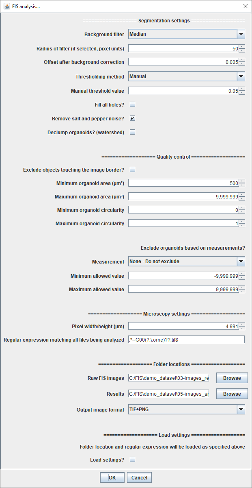

# Open-source workflow for forskolin-induced swelling (FIS) assay analysis
*Quick reference guide*


## Table of Contents
* [1. Overview](#overview)
* [2. Setup](#setup)
  * [2.1. File renaming](#setup-renaming)
  * [2.2. Image analysis](#setup-imageanalysis)
  * [2.3. Data analysis](#setup-dataanalysis)
* [3. Demonstration dataset](#dataset)
    * [3.1. Assay description](#dataset-description)
    * [3.2. File download](#dataset-files)
* [4. Analysis of the demonstration dataset](#analysis)
    * [4.1. Generation of TIF files](#analysis-exporttif)
    * [4.2. Generation of well descriptors (infile)](#analysis-infile)
    * [4.3. Renaming raw files](#analysis-renaming)
    * [4.4. Image analysis](#analysis-imageanalysis)
        * [4.4.1. CellProfiler](#analysis-imageanalysis-CP)
        * [4.4.2. Fiji/ImageJ](#analysis-imageanalysis-IJ)
            * [4.4.2.1. Test mode](#analysis-imageanalysis-IJ-testmode)
            * [4.4.2.2. Batch analysis mode](#analysis-imageanalysis-IJ-batchmode)
     * [4.5. Statistical data analysis](#analysis-statistics)
* [5. Interpretation of the results](#interpretation)
* [6. License](#license)
* [7. Citation](#citation)
* [8. References](#references)


## <a name="overview">1. Overview</a>
The forskolin-induced swelling (FIS) assay [[1](#ref01)] has become the preferential assay to assess the efficacy of established and investigational CFTR-modulating compounds for individuals that suffer from cystic fibrosis (CF) [[2](#ref02)]. In this quick reference manual we explain how to use our open-source workflow to perform standardized analysis of CFTR function measurements of intestinal (CF) organoids.

The workflow comprises of three steps:

1. **Renaming of raw microscopy images**  
    * *Convert raw microscopy images into a common format, regardless of microscope brand or imaging modality;*  
    * *Include experimental metadata in file names;*  
    * *Implemented in the **htmrenamer** tool.*  
    *[More info](https://github.com/hmbotelho/htmrenamer)*


2. **Image analysis**  
    * *Measurement of total organoid area per time frame;*  
    * *Implemented in **CellProfiler** or **Fiji/ImageJ**.*  
    *[More info](https://github.com/hmbotelho/FIS_image_analysis)*  


3. **Statistical data analysis**  
    * *Data visualization, exploratory analysis, quality control and normalization;*  
    * *Implemented in **Organoid Analyst**.*  
    *[More info](https://github.com/hmbotelho/organoid_analyst)*

<br/>

<p align="center"></p>


<br/>


The workflow processes a time-lapse imaging dataset and calculates the total organoid cross-sectional area per well and computes the following statistics from the data (see figure below and [this link](https://github.com/hmbotelho/organoid_analyst#2-statistical-background) for details):  

* **AUC (area under the curve):** the area under the normalized FIS kinetics curve (baseline: 100%);  
* **ISR (initial swelling rate):** the slope of a fitted line to the region of maximal linear swelling in a normalized FIS kinetics curve;  
* **Aₜ/A₀:** the percentage of area increase during the FIS experiment.  

<br/>

<p align="center"></p>

<br/>


Currently, **ZEISS** and **Leica** imaging datasets are supported and the image analysis can be performed by either using [**CellProfiler**](https://cellprofiler.org/) or [**Fiji**](http://fiji.sc/), as depicted in the following scheme:  

<br/>

<p align="center"></p>

<br/>

This document contains links to all the required software tools, together with a demonstration dataset and the expected results following analysis of the dataset.  


## <a name="setup">2. Setup</a>
This section describes how to install the software that is required for the FIS analysis workflow.  


### <a name="setup-renaming">2.1. File renaming</a>

[Detailed information](https://github.com/hmbotelho/htmrenamer)  

* **ZEISS files**  
    
    1. **Installation of ZEN (blue edition):** The LITE version can be downloaded [here](https://www.zeiss.com/microscopy/int/products/microscope-software/zen-lite.html).  


* **Leica files**  
    
    1. Images must be acquired with the [Leica LAS X](https://www.leica-microsystems.com/products/microscope-software/p/leica-las-x-ls/) software, either on the MatrixScreener or Navigator modules.  


* **Installation of the htmrenamer R package**  

    1. **Install <a name="setup-R">R</a>:** Download [here](https://cran.r-project.org/).  


    2. **Install <a name="setup-commandlinetools">Command Line Tools for Xcode</a> (macOS only):** Download and install the latest version matching your macOS version from [here](https://developer.apple.com/download/more/?=command%20line%20tools) (Apple ID required).  

    
    3. **Install XQuartz (macOS only):** Download [here](https://www.xquartz.org/).  


    4. **Install the htmrenamer package:** download the [latest htmrenamer release](https://github.com/hmbotelho/htmrenamer/releases) (`htmrenamer_xxx.tar.gz`). Open R and install via the command line:

	**Windows:**  
	```
	install.packages(c("gWidgets2", "gWidgets2tcltk", "openxlsx", "reshape2", "tiff", "XML"), dependencies=T)
    install.packages("c:/path_to_file/htmrenamer_xxx.tar.gz", repos=NULL)
	```

	**macOS:**  
	```
	install.packages(c("gWidgets2", "gWidgets2tcltk", "openxlsx", "reshape2", "tiff", "XML"), dependencies=T)
    install.packages("/path_to_file/htmrenamer_xxx.tar", repos=NULL, type="source")
	```


* **Describe the contents of the assay plate (infile)**

    1. Infile templates can be obtained [here](https://github.com/hmbotelho/htmrenamer/blob/master/extras/InFile_template.xlsx) or through the following R commands:


    ```
    library(htmrenamer)
    newinfile.char(8, 12, show = TRUE, saveto = "myinfile.txt")
    ```

    The infile has a tabular structure:

    ```
    001--A--01--00--00--fsk--0.008
    002--A--02--01--00--fsk--5
    003--A--03--02--00--fsk_vx809--0.008
    004--A--04--03--00--fsk_vx809--5
	...
    ```


### <a name="setup-imageanalysis">2.2. Image analysis</a>

[Detailed information](https://github.com/hmbotelho/FIS_image_analysis)  

* **Image analysis using CellProfiler**  

    1. **Install CellProfiler:** download [here](https://cellprofiler.org/releases/)
    
    
    2. **Download image analysis pipelines:** download [here](https://github.com/hmbotelho/FIS_image_analysis/tree/master/CellProfiler)
    

* **Image Analysis using Fiji/ImageJ**  
    1. **Install <a name="setup-Fiji">Fiji</a>:** download [here](http://fiji.sc/).
    
    
    2. **Download image analysis scripts:** download [here](https://github.com/hmbotelho/FIS_image_analysis/tree/master/Fiji_ImageJ).
    
    
    3. **Install scripts: (Windows):** in the folder `\Fiji.app\scripts` create a subfolder named `FIS` and copy the `FIS_test....ijm` and `FIS_analysis....ijm` files to this folder.
    
    
    4. **Install scripts: (macOS):** in Finder, go to Applications, locate Fiji, right click and select `Show Package Contents`. In the `Scripts` folder create a subfolder named `FIS` and copy the `FIS_test....ijm` and `FIS_analysis....ijm` files to this folder.


### <a name="setup-dataanalysis">2.3. Data analysis</a>

[Detailed information](https://github.com/hmbotelho/organoid_analyst)  

1. **A web browser is required to perform the data analysis**


2. **Install R:** see [section above](#setup-R).


3. **Install Command Line Tools for Xcode (macOS only):** see [section above](#setup-commandlinetools).


4. **Install Fiji:** see [section above](#setup-Fiji).


5. **Install Organoid Analyst:** in the R console type
    
```
source("https://raw.githubusercontent.com/hmbotelho/organoid_analyst/master/installer.R")
runGitHub("organoid_analyst", "hmbotelho", launch.browser=T)
```


## <a name="dataset">3. Demonstration dataset</a>


### <a name="dataset-description">3.1. Assay description</a>
The demonstration dataset contains data obtained from a FIS assay that was performed using intestinal organoids homozygous for a
class II CFTR mutation in the absence (DMSO) or in the presence of VX-809 and/or VX-770 (3.2 μM), as previously described [[2](#ref02)]. CFTR was activated by addition of forskolin (Fsk) in a concentration ranging from 0.008 μM – 5 μM. The following conditions were investigated in this experiment, as is depicted below.  

<p align="center"></p>

The following parameters were applied when acquiring the microscopy images that are included in the demonstration dataset:  

- __Imaging system:__ Zeiss confocal microscope
- __Number of plates:__ 1
- __Number of imaged wells:__ 64
- __Number of imaging fields per well:__ 1
- __Number of raw images (TIF):__ 448
- __Number of time points:__ 7
- __Time interval between frames:__ 10 min
- __Total experiment time:__ 60 min
- __Image resolution:__ 512 x 512 pixels  
- __Pixel dimensions:__ 4.991 x 4.991 μm
- __Image bit depth:__ 8 bit
- __Number of fluorescence channels:__ 1 (calcein green)


### <a name="dataset-files">3.2. File download</a>

The demonstration dataset consists of:  
1. [**Raw microscopy images (native CZI format)**](./demo_dataset/00-images_raw) (`00-images_raw/demoplate_01.czi`, 169 MB)
2. [**Raw microscopy images (TIF export)**](./demo_dataset/01-images_exported/demoplate_01) (`01-images_exported/demoplate_01`, 91.8 MB)
3. [**Infile** (well description)](./demo_dataset/02-microscope_infile/demoplate_01.txt) (`02-microscope_infile/demoplate_01.txt`, 3 KB)
4. [**Raw microscopy images (renamed)**](./demo_dataset/03-images_renamed/demoplate_01) (`03-images_renamed/demoplate_01`, 91.9 MB)
5. [**CellProfiler and Fiji image analysis pipelines** (pre-configured for the demonstration dataset)](./demo_dataset/04-analysis_pipelines) (`04-analysis_pipelines`, 1.2 MB)
6. [**Image quantification outputs (CellProfiler)**](./demo_dataset/05-images_analysis/demoplate_01--cellprofiler) (`05-images_analysis/demoplate_01--cellprofiler`, 14.8 MB)
7. [**Image quantification outputs (Fiji)**](./demo_dataset/05-images_analysis/demoplate_01--ij) (`05-images_analysis/demoplate_01--ij`, 239 MB)
8. [**Quantification summary (from CellProfiler data)**](./demo_dataset/05-images_analysis/demoplate_01--cellprofiler--analysis) (`05-images_analysis/demoplate_01--cellprofiler--analysis`, 37.0 MB)
9. [**Quantification summary (from Fiji data)**](./demo_dataset/05-images_analysis/demoplate_01--ij--analysis) (`05-images_analysis/demoplate_01--ij--analysis`, 259 MB)

Download the entire dataset [here](./demo_dataset) (735 MB) or [here](https://cirrus.ciencias.ulisboa.pt/owncloud/s/cFnZQfnT8igWF27) (zip, 291 MB).


## <a name="analysis">4. Analysis of the demonstration dataset</a>

This section explains how to analyze the demonstration dataset using our FIS workflow. This example can be adapted to analyze any FIS dataset. Additional resources are indicated as links in the text.  


### <a name="analysis-exporttif">4.1. Generation of TIF files</a>

TIF files are the required input for the workflow.  


1. Open the native [CZI file](./demo_dataset/00-images_raw/demoplate_01.czi) in ZEN Blue.


2. Export as TIF (`File > Export/Import > Export > TIFF`).

**Expected result:** [`01-images_exported`](./demo_dataset/01-images_exported/demoplate_01)


### <a name="analysis-infile">4.2. Generation of well descriptors (infile)</a>

1. Create a customized infile using [this template](https://github.com/hmbotelho/htmrenamer/blob/master/extras/InFile_template.xlsx) or the following R commands:
    
    ```
    library(htmrenamer)
    newinfile.char(8, 12, show = TRUE, saveto = "myinfile.txt")
    ```


**Infile for the demonstration dataset:** [`demoplate_01.txt`](./demo_dataset/02-microscope_infile)


### <a name="analysis-renaming">4.3. Renaming raw files</a>

The renaming process includes relevant metadate in TIF files names.  

[Detailed information](https://github.com/hmbotelho/htmrenamer)  


1. Open R and type
```
library(htmrenamer)
rename_zeiss_gui()
```


2. Enter the following information:

    * Location of the raw TIF files (`01-images_exported/demoplate_01`)  
    * Location for renamed files (any folder)
    * Location of the infile (`demoplate_01.txt`)
    * Number of rows and columns in the assay plate (8 & 12)


3. Click `Start renaming` and wait for the renaming process to finish.


<p align="center"></p>

<br/>

**Expected result:** [`03-images_renamed`](./demo_dataset/03-images_renamed/demoplate_01)


### <a name="analysis-imageanalysis">4.4. Image analysis</a>

A description of how to perform image analysis of the demonstration dataset, either with CellProfiler or Fiji, is presented in this section. CellProfiler is recommended for most of the analyses as described [here](https://github.com/hmbotelho/FIS_image_analysis#1-background).  

[Detailed information](https://github.com/hmbotelho/FIS_image_analysis)  


### <a name="analysis-imageanalysis-CP">4.4.1. CellProfiler</a>


1. Open CellProfiler.


2. Click `File > Open Project...` and load the [`cp_pipeline_demo.cpproj`](./demo_dataset/04-analysis_pipelines/cp_pipeline_demo.cpproj) file.

<p align="center"></p>


3. Click `Window > Show All Windows On Run` to display all the sequential image processing steps.


4. In the **Images** module, remove all previously listed files (drag mouse and press `delete`) and drag [raw microscopy images](./demo_dataset/03-images_renamed/demoplate_01) into the white box `Drop files and folders here`.


<br/>
Next, the image analysis parameters will be defined interactively:  
<br/>


5. Enter into **Test Mode** by clicking `Test > Start Test Mode`. The active module will now appear underlined (*e.g.* ).


6. Go to  `Test > Choose Image Group` to select a single well to test the image analysis settings. We will use [well B8 (well #20) from the demonstration dataset](./demo_dataset/03-images_renamed/demoplate_01/W0020--fsk_770_809--5/P001--fsk_770_809--5) as an example.


7. Click  until reaching the IdentifyPrimaryObjects module.


8. The **IdentifyPrimaryObjects** module performs organoid segmentation and is the most critical step in the analysis. With the exception of `Name the primary objects to be identified` all settings may need to be adjusted for each experiment, especially the following ones:  
    - **Typical diameter of objects:** in pixel units.  
    - **Threshold correction factor:** controls threshold stringency.  
    - **Threshold smoothing scale:** controls image smoothing before the thresholding step.  
    - **Suppress local maxima that are closer than...:** the approximate radius of the smallest organoid in pixel units.  
    - **Fill holes in identified objects:** we recommend the following settings in this module:  
        * `Never`: when calcein labelling of organoids is intense across all wells and time points.  
        
        * `After both thresholding and declumping`: when there is significant organoid swelling and calcein fluorescence intensity becomes low in the organoid lumen over time.  
        
        **<a name="fig-fillholes">Note</a>:** filling holes may result in an overestimation of organoid size if densely packed organoids are touching each other and producing voids (see below). In this case, the Fiji image analysis approach performs better [details](https://github.com/hmbotelho/FIS_image_analysis#1-background).  
    
    <p align="center"></p>

    
    *Example fluorescence image before and after thresholding with and without fill holes `After both thresholding and declumping`. Note that not using the fill holes operation produces an unsatisfactory segmentation with ring-shaped organoids (arrows). When Fill Holes is enabled, most organoids are correctly segmented but in this example a background region is incorrectly classified as object at the 40 min frame (arrowhead). Segmentation masks have been re-coloured to accurately track objects. Panels show a portion of the entire image.*  


9. Adjust the parameters until satisfactory segmentation of the image is achieved.


10. Click  until reaching the DisplayDataOnImage module.


11. The **DisplayDataOnImage** module allows for overlaying any object feature on top of the microscope image to inform the user of excluded undesired objects following the thresholding criteria for object-level quality control purposes.  


12. The **FilterObjects** module allows for exclusion of individual organoids based on fluorescence intensity of morphological features. In the `Category` and `Measurement` boxes select the feature chosen in step 9. In `Minimum value` and `Maximum value` insert the range of allowed values. Organoids with values outside this range will be discarded.

    <p align="center"></p>
    
    
    *An example where objects with [FormFactor](http://cellprofiler-manual.s3.amazonaws.com/CellProfiler-3.0.0/modules/measurement.html#id17) > 0.3 were approved thereby excluding irregular structures surrounded by cell clumps from the analysis (arrowhead). Segmentation masks show the identified objects from the segmentation step (`organoids_prelim`) and identified objects by applying the quality control criteria (`organoids`). Panels show a portion of the images from [well H4, #88](./demo_dataset/03-images_renamed/demoplate_01/W0088--fsk_809--0.32/P001--fsk_809--0.32) from the demonstration dataset.*
 
    **Disable the filtering by entering excessively low or high values.**  


13. Click  until reaching the TrackObjects module.


14. The **TrackObjects** module assigns unique numeric labels to organoids across all time lapse frames. `Maximum pixel distance to consider matches` should be adjusted to the maximum number of pixels an organoid is expected to drift along two consecutive frames. If `Minimum lifetime` is adjusted to be *n* - 1, where *n* is the number of time points in the time lapse, organoids which are not tracked throughout the entire time lapse will be assigned a *NaN* label and can optionally be excluded from the data analysis.  


15. The **CalculateMath** module converts the pixel size to micron units. In the `Multiply the above operand by` field enter the square of the pixel width/height (*e.g.* if the pixel dimensions are 4.991 × 4.991 μm, the conversion factor is 24.910081).  


16. Use `Test > Choose Image Group` and `Test > Choose Image Set` to examine additional images, until the analysis parameters are suitable for analysis of all images in the dataset.  


17. In **View output settings**, under **Default Output Folder** specify where to store the analyzed data files.


18. Save a copy of the CellProfiler project by clicking `File > Save Project As...`.


19. Activate `Window > Hide All Windows On Run`.


20. Start the analysis of the whole dataset by clicking on the  button.


21. CellProfiler will produce an output folder identifiable by the `--cellprofiler` suffix, containing `objects.csv` and PNG files.


**Expected result:** [`05-images_analysis/demoplate_01--cellprofiler`](./demo_dataset/05-images_analysis/demoplate_01--cellprofiler)


### <a name="analysis-imageanalysis-IJ">4.4.2. Fiji/ImageJ</a>


The Fiji image analysis pipeline comprises of two scripts:  
* The **test** script is used to test single images and determine the analysis parameters for optimal segmentation.
* The **analysis** script processes a complete dataset using the parameters determined above.


#### <a name="analysis-imageanalysis-IJ-testmode">4.4.2.1. Test mode</a>

1. Open Fiji.


2. Open an image (`File > Open...`) to optimize the analysis settings. In this example the [first time point from well B8 (#20) from the demonstration dataset](./demo_dataset/03-images_renamed/demoplate_01/W0020--fsk_770_809--5/P001--fsk_770_809--5/demoplate_01--fsk_770_809--5--W0020--P001--T0000--C00.tif) will be used.


3. Start the test mode by selecting `FIS > FIS test...`.

    <p align="center"></p>

<br/>


4. The test mode window will open.

    <p align="center"></p>


5. Define the analysis parameters for the selected image:  

    * **Background filter:** This filter generates a pseudo-flat field from the fluorescence image, which will be subtracted from the raw fluorescence image to generate a background corrected image.  
    
    * **Radius of filter:** The radius of the background filter.  
    
    * **Offset after background correction:** This value will be subtracted from all pixels after background correction.  
	
	* **Thresholding method:** Select between a manual threshold value or an [auto-thresholding method](https://imagej.net/Auto_Threshold). Thresholding will occur after pseudo-flat field subtraction, offset correction and grey value rescaling to [0 ~ 1].  
    
    * **Manual threshold value:** Only applies for the 'Manual' thresholding method. All pixels above this grey value will be assigned to the objects (organoids).  
    
    * **Fill all holes:** When this box is unchecked, an optimized hole filling algorithm ([conditional fill holes](https://github.com/hmbotelho/FIS_image_analysis#1-background)) will be applied. When this box is checked, a standard fill holes operation will be performed after the thresholding step (all holes are filled [example](#fig-fillholes)).  
    
    * **Remove salt and pepper noise.**  
	
	* **Declump organoids:** separate clustered objects.  
     
    * **Exclude objects touching the image border.**  
    
    * **Minimum/Maximum organoid area:** Sets the minimum/maximum allowed organoid area in μm2 units.  
    
    * **Minimum/Maximum organoid circularity:** Sets the minimum/maximum allowed organoid circularity.  
    
    * **Exclude organoids based on measurement:** In addition to area and circularity one other feature can be selected for additional object-level quality control purposes.  
    
    * **Minimum/Maximum allowed value:** The minimum/maximum allowed values for the additional quality control feature.  
    
    * **Pixel width/height:** Pixel dimension in the raw microscopy image.  


6. Click the `OK` button to test the analysis settings in the open image.  


7. Fiji will apply the test settings and display the results of each analysis step. Images are numbered according to the sequence of the operations that have been performed.  

    <br/>
    
    <p align="center"></p>

    <br/>


8. The `Results` window will display the features of all objects, which may be used for object-level quality control. The `Log` window will display the settings defined in step 5.  
    

9. Inspect the `ORGANOIDS_FINAL` image to judge the quality of background subtraction, segmentation and object/level quality control.  


10. Click the `OK` button in the box below to return to the test mode.


11. If necessary, adjust the settings to obtain an adequate image segmentation.  


12. Click `Cancel` or `X` to exit the test mode.


13. Several images should be tested and inspected prior to running the batch analysis mode to ensure that the selected analysis settings are suitable for the entire dataset.  


14. The Log window can be saved (`File > Save As...`) to automatically load the displayed settings in the batch analysis mode.  


#### <a name="analysis-imageanalysis-IJ-batchmode">4.4.2.2. Batch analysis mode</a>

1. Open Fiji.


2. Start the batch analysis mode by selecting `FIS > FIS analysis...`.


3. The batch analysis window will open.
 
    <p align="center"></p>

    <br/>


4. Enter the parameters determined in the test mode, together with the following three additional parameters:  

    * **Regular expression matching all files being analyzed**: the default expression `.*--C00(?:.ome)??.tif$` will match the images generated by the `htmrenamer` tool. If required, replace `C00` with the channel name for the fluorescence image.  
    
    * **Folder location > Raw FIS images**: Select the folder containing the renamed fluorescence images ([`demoplate_01`](./demo_dataset/03-images_renamed/demoplate_01)).  
    
    * **Folder location > Results**: Specify the folder where the results of the analysis will be saved.   
    
    If `Load settings?` is checked Fiji will ask for the settings file generated during the test mode. This loads all settings except the regular expression and folder locations.  
	
	The demonstration dataset included with this guide was analyzed using the following settings:


    <a name="parameters-ij"></a>

    | **Parameter**                                | **Value**              |
    |----------------------------------------------|------------------------|
    | _Background filter_                          | Median                 |
    | _Radius of filter_                           | 50                     |
    | _Offset after background correction_         | 0.005                  |
	| _Thresholding method_                        | Manual                 |
    | _Manual threshold value_                     | 0.05                   |
    | _Fill all holes?_                            | No                     |
    | _Remove salt and pepper noise?_              | Yes                    |
	| _Declump organoids?_                         | No                     |
    | _Exclude objects touching the image border?_ | No                     |
    | _Minimum organoid area_                      | 500 μm²                |
    | _Maximum organoid area_                      | 99999999 μm²           |
    | _Minimum organoid circularity_               | 0                      |
    | _Maximum organoid circularity_               | 1                      |
    | _Exclude organoids based on measurements?_   | None - Do not exclude  |
    | _Minimum allowed value_                      | _Irrelevant_           |
    | _Maximum allowed value_                      | _Irrelevant_           |
    | _Pixel width/height_                         | 4.991 μm               |
    | _Regular expression_                         | .*--C00(?:.ome)??.tif$ |


5. Click `OK` to start the analysis.


6.	Fiji will produce an output folder identifiable by the `--ij` suffix, containing `objects.csv`, TIF and `settings_YYYY-MM-DD_HH-MM.log` files.


**Expected result:** [`05-images_analysis/demoplate_01--ij`](./demo_dataset/05-images_analysis/demoplate_01--ij)


### <a name="analysis-statistics">4.5. Statistical data analysis</a>

This section describes how to use the [**Organoid Analyst**](https://github.com/hmbotelho/organoid_analyst/) application to visualize the image analysis measurements and how to compute summary statistics of the dataset. Organoid Analyst can analyze one dataset (i.e. one 96-well plate) at a time.  

[Detailed information](https://github.com/hmbotelho/organoid_analyst)  


1. Open R and type the following commands:

```
library(shiny)
runGitHub("organoid_analyst", "hmbotelho", launch.browser = T)
```


2. Organoid Analyst will open in a new browser window
    
    <p align="center"></p>

    <br/>


3. Under `1. Load data`, click on `Choose a '--cellprofiler' or '--ij' folder...` and select the [`demoplate_01--cellprofiler`](./demo_dataset/05-images_analysis/demoplate_01--cellprofiler) folder.


4. Organoid Analyst concatenates the `objects.csv` files (one per well) generated during the image analysis process.


5. Under `2. Settings` enter or select relevant information of the experiment:  


    | **Parameter**                                  | **Value**                                                         |
    |------------------------------------------------|-------------------------------------------------------------------|
    | **Experiment Settings**                        |                                                                   |
    | _Time resolution (minutes per timepoint)_      | 10                                                                |
    | _Name of the column with AREA values_          | Math_area_micronsq                                                |
    | _Name of the column with TIME values_          | Metadata_timeNum                                                  |
    | _Name of the column with WELL values_          | Metadata_wellNum                                                  |
    | _Name of the column with COMPOUND names_       | Metadata_compound                                                 |
    | _Name of the column with CONCENTRATION values_ | Metadata_concentration                                            |
    | _Number of rows_                               | 8                                                                 |
    | _Number of columns_                            | 12                                                                |
    | **Quality Control Settings**                   |                                                                   |
    | Name of the column with organoid ID            | TrackObjects_Label_4                                              |
    | ID of invalid organoids                        | Allow all organoids                                               |
    | Name of the column with organoid center (X)    | AreaShape_Center_X                                                |
    | Name of the column with organoid center (Y)    | AreaShape_Center_Y                                                |
    | **File Remapping Settings**                    |                                                                   |
    | Column with file path                          | Metadata_FileLocation                                             |
    | Image root folder name in table                | file:///C:/FIS                                                    |
    | Image root folder name in this computer **[¹](#t1_1)**  | C:\FIS                                                   |
    | **Segmentation Masks Settings**                |                                                                   |
    | Generate segmentation masks?                   | Yes                                                               |
    | Image root folder name in table                | file:///C:/FIS/demo_dataset/03-images_renamed/demoplate_01        |
    | Image root folder name in this computer **[²](#t1_2)**  | C:\FIS\demo_dataset\05-images_analysis\demoplate_01--cellprofiler |
    | Length of image suffix  **[³](#t1_3)**         | 9                                                                 |
    | Suffix for segmentation mask files **[⁴](#t1_4)** | --masks.png                                                       |
    | Suffix for Organoid Analyst masks file **[⁵](#t1_5)** | --OAmask                                                          |
    | Suffix for Organoid Analyst labels file **[⁶](#t1_6)** | --OAlabel                                                         |
    | **Interaction with Fiji Settings**             |                                                                   |
    | Path to Fiji (Windows)           | C:/Fiji.app/ImageJ-win64.exe                                      |

* **<a name="t1_1">¹</a>** Select the [folder](./demo_dataset/03-images_renamed/demoplate_01) that contains the raw microscopy images on your computer (`demoplate_01` in the demonstration dataset).*  
* **<a name="t1_2">²</a>** Select the location of the `demoplate_01--cellprofiler` [folder](./demo_dataset/05-images_analysis/demoplate_01--cellprofiler) on your computer.*  
* **<a name="t1_3">³</a>** The image analysis process saves object segmentation masks in files which are named as the raw microscopy images, except for a small suffix (or termination). For example: one raw microscopy image file in the demonstration dataset is named `demoplate_01--fsk--0.008--W0001--P001--T0000--C00.tif` and the corresponding segmentation masks are saved in file `demoplate_01--fsk--0.008--W0001--P001--T0000--masks.png`. The last 9 characters in the raw file names (`--C00.tif`) are the mentioned suffix.*  
* **<a name="t1_4">⁴</a>** The suffix in the segmentation masks image (see **[³](#t1_3)**)*  
* **<a name="t1_5">⁵</a>** Any suffix can be entered, as this does not affect the data analysis process.*  
* **<a name="t1_6">⁶</a>** Select the location of the Fiji executable file on your computer. Not required when running macOS.*  


6. Click on `Normalize data`.


7. Organoid Analyst normalizes the data and updates the segmentation masks.

   
8. Under `3. Plotting` interactive data exploration, image visualization and per well quality control can be performed.

    <br/>

    <p align="center"></p>

    <br/>
    
    
    The following options are available:
    
    * **Analysis settings:** Allows for specifying the final time point of the experiment and the time interval that has to be used for calculation of the initial swelling rate.  
        
    * **Quality control:** The possibility to exclude individual wells from the analysis (e.g. wells with imaging aberrations or insufficient organoids).  
        
    * **Time-lapse viewer:** Opens images of selected wells as time-lapse sequences in Fiji. Select the wells of interest and click 
    
    <p align="center"></p>
    
    <br/>
    
        
    * **Plots:** Organoid Analyst visualizes the quantitative FIS data as five different plots:
    
        * A multi-well plate layout with the normalized kinetic curves being displayed for each well. In this plot the ISR can also be visualized.  
    
        * A dose-response plot of the AUC measurements.  
    
        * Bar plots representing summarized AUC, ISR and Aₜ/A₀ measurements (average ± SD across identically treated wells).  


    The demonstration dataset was analyzed using the following settings:

    | **Parameter**                    | **Value** |
    |----------------------------------|-----------|
    | Select initial data points       | 10 ~ 30   |
    | Select final experiment time     | 60        |
    | Wells excluded from calculations | None      |


9. Click the `Export data` button to save the analyzed dataset into the selected output folder.  

10. The following files will be generated:

    * **Updated segmentation masks**
    * **Updated organoid labels**
    * `FIS_normalized.xlsx` Data for individual wells: sum of all organoid areas, normalized areas, normalized areas subtracted of the 100% baseline, and cumulative AUC.
    * `FIS_rawdata.csv` Concatenation of the objects.csv files.
    * `FIS_summary_xxmin.xlsx` Per-treatment summary of AUC, ISR and Aₜ/A₀ measurements.
    * `FISanalysis_dd-mm-yy_hh-ss.log` Organoid Analyst settings.
    * `plot_AtA0_xxmin.png` Bar plot of summarized Aₜ/A₀ measurements.
    * `plot_AUC_xxmin.png` Bar plot of summarized AUC measurements.
    * `plot_initialswellingrate_xxmin.png` Bar plot of summarized ISR measurements.
    * `plot_overview.png` Plate layout with normalized kinetic curves.
    * `plot_titration_AUC_xxmin.png` Dose-response plot for AUC measurements.


11. Below are the AUC values determined with the demonstration dataset


**CellProfiler image analysis**

[`05-images_analysis/demoplate_01--cellprofiler`](./demo_dataset/05-images_analysis/demoplate_01--cellprofiler) folder.


| **Compounds**         | **[Fsk] (μM)** | **AUC (mean)** | **AUC (sd)** |
|-----------------------|----------------|----------------|--------------|
| Fsk                   | 0.008          |          16.64 |        29.54 |
| Fsk                   | 0.02           |          -2.07 |        36.18 |
| Fsk                   | 0.05           |          14.76 |         6.87 |
| Fsk                   | 0.128          |         -64.81 |         2.29 |
| Fsk                   | 0.32           |         -29.95 |         1.13 |
| Fsk                   | 0.8            |          -1.88 |        14.57 |
| Fsk                   | 2              |           43.7 |         12.3 |
| Fsk                   | 5              |          47.43 |        44.05 |
| Fsk + VX-770          | 0.008          |          51.47 |         9.07 |
| Fsk + VX-770          | 0.02           |          34.49 |         7.05 |
| Fsk + VX-770          | 0.05           |           5.35 |        24.62 |
| Fsk + VX-770          | 0.128          |            4.7 |        40.07 |
| Fsk + VX-770          | 0.32           |          80.22 |        14.19 |
| Fsk + VX-770          | 0.8            |         359.88 |         12.5 |
| Fsk + VX-770          | 2              |         449.02 |        11.39 |
| Fsk + VX-770          | 5              |          513.1 |         9.65 |
| Fsk + VX-809          | 0.008          |          25.54 |        18.77 |
| Fsk + VX-809          | 0.02           |          72.81 |         8.57 |
| Fsk + VX-809          | 0.05           |         -13.86 |         11.9 |
| Fsk + VX-809          | 0.128          |         -25.36 |        27.24 |
| Fsk + VX-809          | 0.32           |          14.76 |        13.59 |
| Fsk + VX-809          | 0.8            |         171.86 |         5.63 |
| Fsk + VX-809          | 2              |         734.43 |       114.55 |
| Fsk + VX-809          | 5              |        1361.16 |        74.95 |
| Fsk + VX-770 + VX-809 | 0.008          |          30.24 |          4.7 |
| Fsk + VX-770 + VX-809 | 0.02           |           52.6 |        19.01 |
| Fsk + VX-770 + VX-809 | 0.05           |         156.59 |        73.21 |
| Fsk + VX-770 + VX-809 | 0.128          |         477.28 |       238.58 |
| Fsk + VX-770 + VX-809 | 0.32           |        1329.92 |       155.75 |
| Fsk + VX-770 + VX-809 | 0.8            |        2522.41 |        63.19 |
| Fsk + VX-770 + VX-809 | 2              |        2620.19 |       289.62 |
| Fsk + VX-770 + VX-809 | 5              |        2998.54 |       149.31 |

<p align="center"></p>

<br/>


**Fiji image analysis**

Performing an equivalent analysis of the data in [`05-images_analysis/demoplate_01--ij`](./demo_dataset/05-images_analysis/demoplate_01--ij) folder yields the following results:


| **Compounds**         | **[Fsk] (μM)** | **AUC (mean)** | **AUC (sd)** |
|-----------------------|----------------|----------------|--------------|
| Fsk                   | 0.008          |         -14.55 |        68.73 |
| Fsk                   | 0.02           |          22.95 |        38.08 |
| Fsk                   | 0.05           |         -38.11 |        14.25 |
| Fsk                   | 0.128          |         -84.04 |         0.34 |
| Fsk                   | 0.32           |         -24.70 |        15.25 |
| Fsk                   | 0.8            |         -48.61 |        19.19 |
| Fsk                   | 2              |         -10.84 |        20.23 |
| Fsk                   | 5              |          33.56 |        55.63 |
| Fsk + VX-770          | 0.008          |         -44.72 |         6.45 |
| Fsk + VX-770          | 0.02           |         -25.54 |        42.62 |
| Fsk + VX-770          | 0.05           |         -49.76 |        30.29 |
| Fsk + VX-770          | 0.128          |         -94.97 |        55.25 |
| Fsk + VX-770          | 0.32           |          40.29 |         9.84 |
| Fsk + VX-770          | 0.8            |         196.14 |        43.69 |
| Fsk + VX-770          | 2              |         254.76 |        67.97 |
| Fsk + VX-770          | 5              |         390.52 |         1.80 |
| Fsk + VX-809          | 0.008          |          -0.42 |        47.88 |
| Fsk + VX-809          | 0.02           |          32.71 |         1.53 |
| Fsk + VX-809          | 0.05           |         -21.92 |        15.45 |
| Fsk + VX-809          | 0.128          |         -47.16 |        13.48 |
| Fsk + VX-809          | 0.32           |         -23.64 |         3.66 |
| Fsk + VX-809          | 0.8            |          97.87 |        31.26 |
| Fsk + VX-809          | 2              |         491.27 |        79.05 |
| Fsk + VX-809          | 5              |         997.04 |        84.73 |
| Fsk + VX-770 + VX-809 | 0.008          |          -4.00 |        31.17 |
| Fsk + VX-770 + VX-809 | 0.02           |         -74.63 |        32.17 |
| Fsk + VX-770 + VX-809 | 0.05           |          89.73 |        61.40 |
| Fsk + VX-770 + VX-809 | 0.128          |         379.10 |       231.87 |
| Fsk + VX-770 + VX-809 | 0.32           |        1122.95 |        77.37 |
| Fsk + VX-770 + VX-809 | 0.8            |        1963.72 |        60.83 |
| Fsk + VX-770 + VX-809 | 2              |        2212.82 |       323.37 |
| Fsk + VX-770 + VX-809 | 5              |        2645.44 |       139.45 |

<p align="center"></p>

<br/>


**Expected result (CellProfiler image analysis):** [`05-images_analysis/demoplate_01--cellprofiler--analysis`](./demo_dataset/05-images_analysis/demoplate_01--cellprofiler--analysis)


**Expected result (Fiji image analysis):** [`05-images_analysis/demoplate_01--ij--analysis`](./demo_dataset/05-images_analysis/demoplate_01--ij--analysis)


## <a name="interpretation">5. Interpretation of the results</a>

In organoids of **cystic fibrosis** patients CFTR activity (i.e. organoid swelling) is absent, or very low, in experiments without treatment with CFTR-modulating compounds (DMSO) due to lack of CFTR activity being the primary biological defect underlying cystic fibrosis. **Class II** CFTR mutations produce misfolded CFTR molecules, which are retained inside the cell and do not reach their localization at the plasma membrane where they can exert their function. If these defective proteins are rescued by CFTR modulators and do reach the plasma membrane they are unable to open and close the channel (so called gating defects). The data here are indicative of such class II mutations as CFTR activity was only restored by the combined treatment of a CFTR corrector (VX-809) and potentiator compound (VX-770) together and not by either of these compounds alone. We would like to refer the reader also to the publication of Dekkers *et al.* [[2](#ref02)] for additional representative FIS curves of CF organoids with various CFTR mutations.


## <a name="license">6. License</a>
This project is licensed under the terms of the GNU General Public License v3.0 (GNU GPLv3).


## <a name="citation">7. Citation</a>
Hagemeijer MC, Vonk AM, Awatade NT, Silva IAL, Tischer C, Hilsenstein V, Beekman JM, Amaral MD, Botelho HM (2020) **An open-source high-content analysis workflow for CFTR function measurements using the forskolin-induced swelling assay** *submitted*


## <a name="references">8. References</a>
<a name="ref01">[1]</a> Dekkers *et al* (2013) **A functional CFTR assay using primary cystic fibrosis intestinal organoids**. *Nat Med* 19, 939-945. [https://doi.org/10.1038/nm.3201](https://doi.org/10.1038/nm.3201)

<a name="ref02">[2]</a> Dekkers *et al* (2016) **Characterizing responses to CFTR-modulating drugs using rectal organoids derived from subjects with cystic fibrosis**. *Sci Transl Med* 8(344), 344ra84. [https://doi.org/10.1126/scitranslmed.aad8278](https://doi.org/10.1126/scitranslmed.aad8278)
